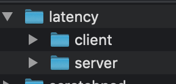

# latency

1. create the project

   
```
2. cd latency
3. git init
4. git add --all
5. git commit -m "Initial commit"
```
6. create repo *latency* in github
```
6. git remote add origin https://github.com/pbelathur/latency.git
7. git push -u origin master
```
